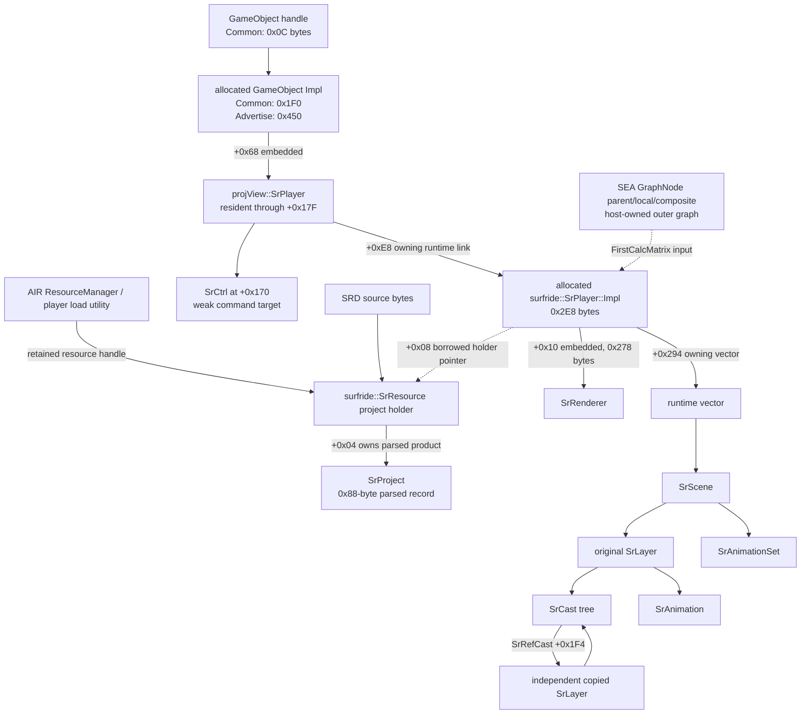
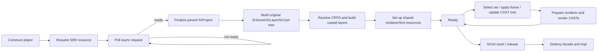

# Chusan 2.50 Surfride runtime architecture

This is the runtime companion to [`srd-format.md`](srd-format.md). For
producer-thread changes to a live game-owned player, use the
[`runtime-mutation-guide.md`](runtime-mutation-guide.md). This document records
what the **32-bit x86** `chusanApp_MATE_2.50.exe` runtime constructs after an
SRD has been parsed. It is not a C++ header and must not be used to make the
native Rust editor dereference game addresses.

## Evidence scope and conventions

- **Direct** means an instruction, allocation request, constructor, or call
  chain was inspected in the `chusanapp_mate_2_50` IDA database. Addresses
  below are image virtual addresses in `chusanApp_MATE_2.50.exe`, whose mapped
  image range is `0x401000..0x229D000` and whose processor is 32-bit x86.
- **Corroborated** means the direct runtime result is also documented through
  the parser/renderer evidence linked below.
- **Boundary** means the representation or semantics have not been established.
  It is deliberately not named from layout resemblance.
- Every pointer in a size/offset table is four bytes. None of these layouts are
  a host-Rust ABI. `src/srplayer_runtime.rs` exposes them only as safe numeric
  descriptors and semantic lifecycle/ownership data.

The main direct construction facts are `sub_AA68B0` (`0xAA68B0`), which
allocates `0x2E8` bytes at `0xAA6CA5`, calls the Impl constructor `0xAA67A0`,
and stores the result at `projView::SrPlayer+0xE8`; and
`projView::SrPlayer::load` (`0xBA6BF0`). Parsed-resource and runtime-scene
relationships are independently documented in
[`evidence/project-scene-reference.md`](evidence/project-scene-reference.md),
[`evidence/projection.md`](evidence/projection.md), and
[`evidence/scene-animation-sets.md`](evidence/scene-animation-sets.md).

## Terms: resource, runtime object, and host object

| Term | What it is | Persisted in the SRD? | Mutated per player/frame? |
| --- | --- | ---: | ---: |
| `SrProject` resource | Parsed `SRFF/SRCK/PROJ` record, including CAM and parsed SCN records | Yes | No; it is source data |
| `surfride::SrPlayer::Impl` | Player-owned, heap-allocated runtime owner | No | Yes |
| `SrScene`, `SrLayer`, `SrCast`, `SrAnimation`, `SrAnimationSet` | Independently allocated members of the player runtime tree | No | Yes |
| copied reference `SrLayer` | A second runtime instance built from a target parsed LAYR for one RefCast | No | Yes, independently from its source layer |
| `sea::GraphNode` / game object | Outer game/SEA scene-graph placement and lifecycle | No | Host-owned |
| `projView::SrPlayer` | Host-facing player facade embedded in a game-object implementation | No | Owns the link to the Surfride Impl |

A parsed record is therefore **not** its corresponding runtime object. For
example, a parsed `LAYR` is reused to construct the original runtime layer and
one new copied runtime layer per resolved RefCast; those instances have separate
world state and animation state. The precise copy/bind/update/render evidence
is in [`evidence/reference-runtime-recursion.md`](evidence/reference-runtime-recursion.md).

## Ownership and hierarchy



### Outer graph is not the Surfride hierarchy

`projView::SrPlayer` has a `sea::GraphNode` base: parent pointer `+0x1C`, local
3x4 affine matrix `+0x64`, and composite 3x4 affine matrix `+0x94`. The
`FirstCalcMatrix` property only selects which outer-graph matrix is supplied to
renderer preparation; it does not change any serialized SRD record. The
Surfride hierarchy is a separate `SrScene -> SrLayer -> SrCast` tree, built
from parsed `SCN/LAYR/NODE` records.

For the audited Chusan `AdvertiseLogoObject` and `CommonBackGroundObject`, no
GraphNode attachment was found: their parent is null and the constructed
matrices remain identity. That is a fact about those concrete host objects, not
a universal SRD preview default. See
[`evidence/chusan-advertise-logo-player.md`](evidence/chusan-advertise-logo-player.md)
and
[`evidence/chusan-common-background-player.md`](evidence/chusan-common-background-player.md).

`SrCtrl` is the 12-byte subobject at `projView::SrPlayer+0x170`: vptr at
`+0x00`, weak object pointer at `+0x04`, and weak reference-control pointer at
`+0x08`. `0xACBE40` copies those two weak fields from the player's
`WeakParent<surfride::SrPlayer>` subobject at player `+0xDC`; destruction drops
only the weak count. It mediates reset/enable and delayed commands but is not a
second owner of either player or runtime tree. Every command must tolerate an
expired target.

## Allocation and offset surface

### Host facade and player runtime

| Object / range | Exact size or observed extent | Direct construction evidence | Proven fields |
| --- | ---: | --- | --- |
| Common game-object handle | `0x0C` | concrete Common object path | holds its implementation |
| Common game-object Impl | `0x1F0` | concrete Common allocation | embedded `projView::SrPlayer` at `+0x68` |
| Advertise game-object Impl | `0x450` | `sub_C94580` / `sub_C94630` | embedded player at `+0x68`; `GameObjectBase` at `+0x438` |
| `projView::SrPlayer` | resident through `+0x17F` | `0xBA5080`, `0xBA6BF0` | Impl pointer `+0xE8`; SRD path `+0x140`; texture root `+0x158`; SrCtrl `+0x170`; load bits `+0x17E` |
| `surfride::SrPlayer::Impl` | `0x2E8` allocated | `0xAA6CA5` allocation, `0xAA67A0` constructor | resource holder `+0x08`; owner-player pointer `+0x0C`; embedded renderer `+0x10`; runtime scene vector `+0x294`; reference helper state `+0x2A0` |
| `SrRenderer` | embedded at Impl `+0x10` | `0xAA67DF` calls its constructor | see next table |

`0xAA67A0` explicitly clears `Impl+0x288..+0x29C`, including the three-word
vector beginning at `+0x294`; it also constructs the subobject at `+0x2A0`.
That makes the top-level scene table a runtime allocation, not an alias for the
parsed SCN array.

### Renderer fields used by the SRD path

| `SrRenderer` offset | Proven role |
| ---: | --- |
| `+0x08` | project-to-target matrix; initialized identity and only configured after a non-null named target lookup |
| `+0x48` | culling projection/viewport matrix; initialized identity; used by the corner projection for culling, not final image vertices |
| `+0x88` | inverse SRD-camera View 3x4 for special CAST matrices |
| `+0xB8` | outer-graph `FirstCalcMatrix` copied for runtime-layer root composition |
| `+0x190` | draw-target filter block copied to draw packet `+0x80`; first dword is DrawMask |
| `+0x198` | inherited packet key; property `2DLayer` owns bits `8..14` |
| `+0x248` | exact named TargetScene lookup result; null skips the target Camera/viewport setup |
| `+0x24C..+0x258` | culling rectangle center/half extents, only written on non-null target path |
| `+0x26C` | shared font/TextBox resource tree |
| `+0x274` | renderer mask byte combined with `SrImage` stencil state |

The null-target `+0x24C..+0x258` read remains a real native uninitialized-read
boundary. The editor deterministically skips that culling operation instead of
inventing a viewport rectangle. See
[`evidence/render-visibility-culling.md`](evidence/render-visibility-culling.md)
and [`evidence/render-empty-target-matrices.md`](evidence/render-empty-target-matrices.md).

### Runtime scene, layer, and animation objects

| Object | Allocation | Direct constructor | Proven surface |
| --- | ---: | --- | --- |
| `SrScene` | `0x78` | `0xAC1BC0` | parsed SCN `+0x04`; Impl owner `+0x08`; name `+0x0C`; `vector<SrLayer*> +0x24`; `vector<SrAnimationSet*> +0x30`; embedded animation state `+0x3C..+0x6F`; current set `+0x70`; runtime bytes `+0x74/+0x75` |
| `SrLayer` | `0x2AC` | `0xABC8D0`; built by `0xAC00B0` | parsed LAYR `+0x0C`; name `+0x10`; animations `+0x28`; CAST vector `+0x4C`; roots `+0x64`; mode `+0x130`; flip-Y `+0x131`; local state `+0x13C`; enable `+0x168`; world `+0x16C`; composed colors `+0x208/+0x20C`; visibility `+0x210`; source/copy relation `+0x248`; owning RefCast `+0x24C`; binding values `+0x250/+0x254` |
| `SrAnimation` | `0x8C` | `0xAD4D40` | name `+0x04`; raw frame bits `+0x1C`; duration `+0x20`; factors `+0x24/+0x28/+0x2C`; flags `+0x30`; parsed ANIM `+0x34`; layer owner `+0x38`; vectors `+0x3C/+0x48`; strings `+0x54/+0x6C`; tail fields `+0x84/+0x88` |
| `SrAnimationSet` | `0x30` | `0xAD7030` | parsed ANMS `+0x04`; name `+0x08`; scene owner `+0x20`; per-layer entry vector `+0x24`; each entry allocation `0x28` |

`SrScene+0x75` is the scene visibility state that the normal update writes to a
project layer. A copied reference layer instead takes the owning RefCast gate;
those are intentionally distinct conditions. Scene-animation selection and
ANMS/SANM layer gating are documented in
[`evidence/scene-animation-sets.md`](evidence/scene-animation-sets.md), and
per-animation frame and duration state in
[`evidence/animation-records.md`](evidence/animation-records.md).

## CAST base and concrete factories

`SrCast` construction begins at `0xAD3020`. The shared base is exactly `0x1F4`
bytes: parsed NODE `+0x04`, typed parsed record (`NODE+0x50`) `+0x0C`, parent
`+0x30`, child vector `+0x34`, flags `+0x4C`, inherited renderer key `+0x50`,
local transform `+0x5C`, local multiplicative/additive colors `+0x80/+0x84`,
world affine matrix `+0x8C`, composed colors `+0xBC/+0xC0`, and derived
visibility `+0xC4`.

`0xACA030` dispatches NODE type. Type `1` chooses Text only if its CIMG has a
`TEXT` child and CIMG flags include `0x100`; otherwise it chooses Image. That
is a factory condition, not a parser convenience.

| NODE selection | Concrete factory / constructor | Allocation | Proven tail fields |
| --- | --- | ---: | --- |
| default / unsupported type | Null factory `0xAC9CE0`, base ctor `0xAD3020` | `0x1F4` | no concrete tail beyond base |
| type 1, non-Text CIMG | Image factory `0xAC9BA0`, base ctor `0xAD3020` | `0x228` | embedded `SrImage +0xF8`; point selector `+0x100`; CREF/CRE1 pointers `+0x1A4/+0x1A8`; counts `+0x1AC/+0x1B0`; coordinate multiplier `+0x210` |
| type 1, Text CIMG | Text factory `0xAC9FB0`, ctor `0xAD8270` | `0x350` | text playback/layout state `+0x1F4`; string state from `+0x1F8`; FontParam no-wrap mode `+0x2FC` |
| type 2 | Slice factory `0xAC9EF0`, base ctor `0xAD3020` | `0x228` | factory constructs a slice-specific tail subobject at `+0x1F4`; its internal semantic field names are a **boundary** |
| type 3 | Ref ctor `0xADB3B0` | `0x1F8` | independent copied runtime-layer pointer `+0x1F4` |
| type 4 | Number factory `0xAC9D70`, ctor `0xADC2C0` | `0x270` | embedded `SrImage +0xF8`; multiplier `+0x210` initializes as `0.0`; glyph-history vector begin/end/capacity `+0x228/+0x22C/+0x230`, records are 56 bytes |

The Image and Number `SrImage` layouts are not alternative texture records:
CREF and CRE1 remain two separate tables and drive two texture-coordinate
channels. The fields and their rendering consumers are closed in
[`evidence/cimg-image-cast.md`](evidence/cimg-image-cast.md) and
[`evidence/cnum-number-cast.md`](evidence/cnum-number-cast.md). The RefCast
pointer is a link to a new layer instance, never a cached alias of the target
runtime layer; see [`evidence/crfd-reference-cast.md`](evidence/crfd-reference-cast.md).

## Object-by-object x86 memory maps

These are **partial maps of proven fields**, not compilable class declarations.
`ptr32` is a four-byte native pointer. A `vector<T>` label denotes the usual
three-pointer MSVC x86 object beginning at the shown offset; an offset naming a
vector therefore means `begin/end/capacity` at `+0/+4/+8`. A string label
denotes the 24-byte MSVC small-string object observed in constructors. Omitted
ranges are unknown or irrelevant, not implicit padding available to mods.

### Host-facing `projView::SrPlayer` (`0x180`-byte extent)

| Offset | Field or subobject | Pointer/ownership meaning |
| ---: | --- | --- |
| `+0x00` | primary vptr / start of inherited Surfride-AIR-SEA state | dispatch surface; not an `SrPlayer::Impl` vptr |
| `+0x10/+0x14` | SEA GraphNode child range | non-owning graph links |
| `+0x1C` | SEA GraphNode parent | non-owning outer-graph link |
| `+0x28` | graph-name string | player-owned value |
| `+0x58` | inherited graph flags | retained outer state |
| `+0x64` | local affine 3x4 | outer-graph input |
| `+0x94` | composite affine 3x4 | outer-graph result |
| `+0xC4` | property-3 matrix-selection byte | selects local versus composite matrix for `FirstCalcMatrix` |
| `+0xC8` | AIR load/resource utility surface | retains the selected resource while runtime objects borrow parsed data |
| `+0xDC` | `WeakParent<surfride::SrPlayer>` | source of the weak pair copied into `SrCtrl` |
| `+0xE8` | `surfride::SrPlayer::Impl *` | owning heap link; allocated as `0x2E8` bytes |
| `+0xF0` | `sea::ParamCtrlTemplate<surfride::SrPlayer>` | embedded retained-parameter controller through `+0x13F` |
| `+0x140` | primary SRD path string | player-owned value |
| `+0x158` | fallback asset-directory string | player-owned value |
| `+0x170` | `SrCtrl` | embedded weak command façade |
| `+0x17C` | 16-bit façade/controller state | independent from AIR resource state |
| `+0x17E` | 16-bit load flags | bit 0 request submitted; bit 1 loader ready |

Construction of the C++ object is eager, but construction does not parse an
SRD. The `Impl` also exists before load. Content release leaves this complete
object and its Impl reusable for another asynchronous load.

### Heap `surfride::SrPlayer::Impl` (`0x2E8` bytes)

| Offset | Field or subobject | Pointer/ownership meaning |
| ---: | --- | --- |
| `+0x00` | three-entry vptr `0x0190D248` | deleting destructor, scalar update, retained traversal |
| `+0x08` | selected `SrResource *` project holder | borrowed; holder `+0x04` is the resource-owned `SrProject *` |
| `+0x0C` | owning `surfride::SrPlayer *` context | non-owning backpointer despite the descriptive word “owning” |
| `+0x10..+0x287` | embedded `SrRenderer` | value subobject; exact extent `0x278` bytes |
| `+0x294` | `vector<SrScene *>` | owns every original runtime scene pointee |
| `+0x2A0` onward | reference/runtime maps and helpers | player-owned mutable lookup state; individual names remain bounded by evidence |
| `+0x2D4` | additional pointer vector | cleared by reset; pointee role remains unnamed |
| `+0x2E0` | optional runtime helper pointer | owned; deleting reset frees it and writes null |

The important double dereference is exact:

```text
Impl +0x08  -> SrResource/project-holder
holder +0x04 -> SrProject (0x88-byte parsed record)
SrProject +0x58 -> embedded parsed CAM record
```

`0xAAB990` stores the holder, and `0xAACA80` performs the holder `+0x04`
dereference before camera preparation. Calling `Impl+0x08` an `SrProject *`
would drop one pointer level and corrupt every subsequent offset.

### Runtime `SrScene` (`0x78` bytes)

| Offset | Proven role | Lifetime/relationship |
| ---: | --- | --- |
| `+0x04` | parsed `SCN *` | borrowed from `SrProject` |
| `+0x08` | owning Impl context | non-owning backpointer |
| `+0x0C` | copied scene-name string | runtime-owned value |
| `+0x24` | `vector<SrLayer *>` | owns original runtime layers |
| `+0x30` | `vector<SrAnimationSet *>` | owns scene animation-set instances |
| `+0x3C..+0x6F` | embedded scene animation/playback state | mutable per player |
| `+0x70` | current `SrAnimationSet *` | non-owning selection into `+0x30` |
| `+0x74` | runtime state byte | mutable gate/state |
| `+0x75` | scene visibility byte | local retained visibility |

### Runtime `SrLayer` (`0x2AC` bytes)

| Offset | Proven role | Lifetime/relationship |
| ---: | --- | --- |
| `+0x0C` | parsed `LAYR *` | borrowed from the project |
| `+0x10` | copied layer-name string | runtime-owned value |
| `+0x28` | `vector<SrAnimation *>` | owns layer-local timelines |
| `+0x4C` | `vector<SrCast *>` | owns each CAST allocation exactly once |
| `+0x64` | root-cast pointer list | non-owning view into `+0x4C` |
| `+0x130` | effective dimensional/matrix mode | runtime value |
| `+0x131` | copied/reference flip-Y byte | runtime value |
| `+0x13C` | local layer transform/state | retained mutable input |
| `+0x168` | independent layer enable | local gate written by ANMS/SANM selection |
| `+0x16C` | derived world affine 3x4 | recomputed output |
| `+0x208/+0x20C` | composed multiplicative/additive colors | recomputed output |
| `+0x210` | derived visibility | recomputed output; do not patch as retained state |
| `+0x248` | source/original-layer relation | non-owning runtime relation |
| `+0x24C` | owning `SrRefCast *` for a copied layer | non-owning backpointer; null on original layers |
| `+0x250/+0x254` | reference binding index/value | mutable binding state |

An original layer is owned by its scene. A copied layer is a separate `0x2AC`
allocation owned by one `SrRefCast`; both can borrow the same parsed `LAYR`.
Consequently, equality of parsed pointers does not imply shared transforms,
animation frames, visibility, or CAST allocations.

### `SrAnimation` and `SrAnimationSet`

`SrAnimation` is a complete `0x8C`-byte layer-local timeline:

| Offset | Proven role |
| ---: | --- |
| `+0x04` | copied animation-name string |
| `+0x1C` | raw f32 frame bits |
| `+0x20` | runtime duration |
| `+0x24/+0x28/+0x2C` | playback factors, initialized to `1.0` |
| `+0x30` | runtime flags |
| `+0x34` | borrowed parsed `ANIM *` |
| `+0x38` | non-owning owning-layer backpointer |
| `+0x3C/+0x48` | two runtime vectors; exact element semantics remain unnamed |
| `+0x54/+0x6C` | two runtime strings |
| `+0x84/+0x88` | tail state fields |

`SrAnimationSet` is a separate `0x30`-byte scene-level object:

| Offset | Proven role |
| ---: | --- |
| `+0x04` | borrowed parsed `ANMS *` |
| `+0x08` | copied set-name string |
| `+0x20` | non-owning owning-scene backpointer |
| `+0x24` | vector owning `0x28`-byte per-layer set entries |

The two types are not interchangeable. An animation owns one layer-local
frame/duration state and applies `MOT/TRK/KEY` channels to that layer's casts.
An animation set coordinates positional `SANM` entries across a scene's layers,
selects named animations, and writes layer gates.

### `SrCast` base and hierarchy links (`0x1F4` bytes)

| Offset | Proven role | Lifetime/relationship |
| ---: | --- | --- |
| `+0x00` | concrete cast vptr | subtype dispatch |
| `+0x04` | parsed `NODE *` | borrowed from parsed `LAYR` |
| `+0x0C` | typed parsed record pointer from `NODE+0x50` | borrowed `CIMG`, `CSLI`, `CNUM`, or `CRFD` product |
| `+0x30` | parent `SrCast *` | non-owning interior link |
| `+0x34` | child pointer vector | non-owning interior links; layer `+0x4C` owns the allocations |
| `+0x4C` | runtime flags | retained/local state |
| `+0x50` | inherited renderer/order key | composed during traversal |
| `+0x5C` | local transform | retained mutable input |
| `+0x80/+0x84` | local multiplicative/additive colors | retained mutable inputs |
| `+0x88` | local visibility byte | retained mutable input inside the transform/color region |
| `+0x8C` | world affine matrix | derived output |
| `+0xBC/+0xC0` | composed colors | derived outputs |
| `+0xC4` | derived visibility | derived output |

The hierarchy has two ownership views on purpose: the layer's flat CAST vector
owns allocations, while parent/children/root fields encode traversal. Deleting
recursively through child links as well as through the flat vector would double
free the same cast.

### Embedded `SrImage` (`0xD0` bytes at Image/Number cast `+0xF8`)

| `SrImage` offset | CAST-relative offset | Proven role |
| ---: | ---: | --- |
| `+0x00` | `+0xF8` | `SrImage` vptr |
| `+0x04` | `+0xFC` | CIMG flags |
| `+0x08` | `+0x100` | Point-versus-Linear sampling selector |
| `+0x0C` | `+0x104` | MultiTex0 variant input copied from CIMG `+0x34` |
| `+0x10/+0x14/+0x18/+0x1C` | `+0x108..+0x114` | stencil/depth mode, shift, condition, and runtime counter/sentinel state |
| `+0x28` | `+0x120` | borrowed parsed `CIMG *` |
| `+0x80/+0x84` | `+0x178/+0x17C` | width/height |
| `+0x88` | `+0x180` | 3x3 origin mode |
| `+0x8C/+0x90` | `+0x184/+0x188` | custom origin |
| `+0xA0..+0xAB` | `+0x198..+0x1A3` | 12-byte `ExtParamData`: preset, layer bytes, flags |
| `+0xAC/+0xB0` | `+0x1A4/+0x1A8` | borrowed CREF and CRE1 arrays |
| `+0xB4/+0xB8` | `+0x1AC/+0x1B0` | CREF and CRE1 counts |
| `+0xBC/+0xC0` | `+0x1B4/+0x1B8` | refcounted resource-handle slots; precise pointee role remains bounded |

`SrTextCast` is selected from the same NODE type as ImageCast only when a TEXT
child exists and CIMG flags include `0x100`. It does not merely append text to
the `0x228` ImageCast allocation: its factory requests `0x350` bytes and builds
text state at `+0x1F4`. `SrNumberCast` is `0x270` bytes and reuses `SrImage` at
`+0xF8`, but adds a 56-byte-record glyph-history vector at `+0x228`.

## Pointer ownership and invalidation table

| Source field | Target | Relation | Becomes invalid when |
| --- | --- | --- | --- |
| concrete GameObject Impl `+0x68` | `projView::SrPlayer` | embedded value | GameObject Impl is destroyed |
| player `+0xE8` | `SrPlayer::Impl` | owning heap pointer | final player destruction |
| player `+0x170` | `SrCtrl` | embedded value | final player destruction |
| `SrCtrl +0x04/+0x08` | player weak target/control block | weak | target expires or controller resets |
| Impl `+0x08` | `SrResource` holder | borrowed; AIR utility retains it | content release/reload |
| holder `+0x04` | parsed `SrProject` | resource-owned | holder unload/destruction |
| Impl `+0x10` | `SrRenderer` | embedded value | Impl destruction |
| Impl `+0x294` elements | `SrScene` | owned pointees | content release/reload |
| Scene `+0x04` | parsed `SCN` | borrowed | resource release |
| Scene `+0x24` elements | original `SrLayer` | owned pointees | scene destruction |
| Scene `+0x30` elements | `SrAnimationSet` | owned pointees | scene destruction |
| Layer `+0x0C` | parsed `LAYR` | borrowed | resource release |
| Layer `+0x28` elements | `SrAnimation` | owned pointees | layer destruction |
| Layer `+0x4C` elements | `SrCast` | owned pointees | layer destruction |
| Layer `+0x64`, Cast `+0x30/+0x34` | existing casts | non-owning traversal links | owning layer destruction |
| Animation `+0x34` | parsed `ANIM` | borrowed | resource release |
| AnimationSet `+0x04` | parsed `ANMS` | borrowed | resource release |
| Cast `+0x04/+0x0C` | parsed NODE/typed record | borrowed | resource release |
| RefCast `+0x1F4` | copied runtime `SrLayer` | owned pointee | RefCast destruction |
| renderer/image resource slots | Ceylon/AIR resources | retained/refcounted handles | renderer cleanup or content release |

The serialized project must outlive every borrowed parsed pointer. That
invariant is maintained by the player resource utility, not by making every
scene/layer/cast own a copy of its source record. Conversely, parsed records do
not own runtime instances. Runtime release is therefore allowed to delete the
entire mutable tree while leaving the AIR resource cached.

## Worked pointer traversal: `CHU_UI_System_00_v10.srd`

The checked fixture is
`sample/data/surfboard/system/chu_ui_system_00_v10.srd`. Its parsed shape is:

```text
SrProject
  scenes[0] = SCN "CHU_UI_System_00_v10" (1920 x 1080)
    layers[0] = LAYR "L_System_fill"
      nodes[0] = "C_pos"       root
      nodes[1] = "C_fill"      parent = nodes[0], CIMG-backed ImageCast
      nodes[2] = "C_text_pos"  parent = nodes[0]
      nodes[3] = "T_title"     parent = nodes[2], text cast
      nodes[4] = "T_message"   parent = nodes[2], text cast
```

After `0xAAAFE0 -> 0xAC2B80 -> 0xAC00B0 -> 0xACA030`, the corresponding native
pointer walk is:

```text
projView::SrPlayer
  +0xE8 -> Impl
    +0x08 -> SrResource holder
      +0x04 -> SrProject
    +0x294.begin[0] -> SrScene
      +0x04 -> parsed SCN[0]
      +0x24.begin[0] -> SrLayer
        +0x0C -> parsed LAYR[0]
        +0x4C.begin[0] -> SrCast for NODE[0] "C_pos"
        +0x4C.begin[1] -> SrImageCast for NODE[1] "C_fill"
        +0x4C.begin[2] -> SrCast for NODE[2] "C_text_pos"
        +0x4C.begin[3] -> SrTextCast for NODE[3] "T_title"
        +0x4C.begin[4] -> SrTextCast for NODE[4] "T_message"
        +0x64.begin[0] -> the NODE[0] cast

NODE[0] runtime cast
  +0x04 -> parsed NODE[0]
  +0x30 -> null
  +0x34.begin[0] -> NODE[1] runtime cast

NODE[1] runtime cast
  +0x04 -> parsed NODE[1]
  +0x0C -> parsed CIMG selected by NODE[1]+0x50
  +0x30 -> NODE[0] runtime cast
  +0xF8 -> embedded SrImage
```

The runtime addresses are heap-dependent; only the field offsets and ordering
are fixed for this executable. The fixture's first evidence-complete draw is
layer index `0`, node index `1`, matching `C_fill`. This example demonstrates
all three pointer classes at once: borrowed parsed records, flat owning runtime
vectors, and non-owning hierarchy links.

## Frame-state walk through the same objects

The two normal player passes are separate:

```text
scalar/time pass
  SrPlayer virtual +0x10 (0xAACFC0)
  -> virtual +0x88 (0xAA8D10)
  -> Impl virtual +0x04 (0xAA8C40)
  -> each scene (0xAC2140 / 0xAC2F80)

retained traversal / producer-side draw pass
  GraphManagerDraw -> SrPlayer virtual +0x14 (0xAA9C70)
  -> Impl virtual +0x08 (0xAA9BE0)
  -> scene/layer traversal (0xAC21A0 / 0xABE710)
  -> cast tree (0xAC2930)
  -> cast virtual +0x18 via 0xAD45E0
```

The `GraphManager` worker slot `+0x18` is a no-op for this player. The scalar
pass advances retained animation state; the draw pass composes world matrices,
colors, visibility, renderer keys, and render packets. Neither pass makes the
producer-side `GraphManagerDraw` service the D3D draw thread. Packet execution
continues through Ceylon synchronization and its draw-thread pipeline.

State flows from retained inputs to derived outputs:

```text
outer FirstCalcMatrix
  -> SrRenderer +0xB8
scene visibility/current set
  -> layer +0x168 enable
layer +0x13C local transform/color
  -> layer +0x16C/+0x208/+0x20C/+0x210
cast +0x5C/+0x80/+0x84/+0x88 local state
  -> cast +0x8C/+0xBC/+0xC0/+0xC4
  -> concrete cast packet generation
```

Patching `+0x16C`, `+0x210`, `+0x8C`, or `+0xC4` is a symptom-level change:
the next traversal recomputes it. Stable changes go through the façade or the
documented local retained fields and only while the weak controller target is
live.

## Safe lookup rules for tooling

1. Identify the exact PE build before using any address or offset.
2. Require the GameObject's ready status and a live `SrCtrl` weak target.
3. Resolve scene/layer/cast/animation identities again for each operation.
4. Bounds-check every vector before indexing; packed IDs are one-based.
5. Treat every parsed-record pointer as borrowed from the current resource.
6. Treat root/parent/child pointers as non-owning views of the layer cast vector.
7. Never cache an inner runtime pointer across release, reload, or owner status
   transitions.
8. Never splice native vectors. Structural edits require release/rebuild or a
   separate tool-owned runtime representation.

The native façade follows these rules by routing broad commands through weak
`SrCtrl` and constructing a temporary `SrLayerCtrl` for layer/cast/animation
lookups. `SrLayerCtrl` is a transient resolver, not a persistent owner stored in
the player.


## Load, evaluate, render, and release lifecycle



1. **Construct (direct).** `sub_AA68B0` initializes player properties and
   creates the separate `0x2E8` Impl. `sub_BA5080` then adds the
   `projView::SrPlayer` path strings and SrCtrl state.
2. **Request and poll (direct staging; async completion boundary).**
   `projView::SrPlayer::load` (`0xBA6BF0`) requires a filename, checks its
   load-state bits, invokes the delegate at player `+0xC8`, and marks the
   request. Invocation alone is not proof that the parsed project exists.
3. **Finalize parsed resource (direct).** once the resource is available,
   `srd_player_impl_load_project` (`0xAAB990`) stores its holder at
   `SrPlayer::Impl+0x08`; holder `+0x04` is the parsed `SrProject`.
4. **Build runtime tree (direct).** `0xAAAFE0` creates one original runtime
   `SrScene` per parsed SCN, its original runtime layers, CAST hierarchy and
   animation sets. `0xAA9450` then resolves CRFD and constructs independent
   copied layers. It happens before the outer text-resource pass
   (`0xAAC390 -> 0xAAE6C0`), which still visits only original scenes.
5. **Evaluate (direct).** animation-set selection writes the current set and
   layer gates; raw frames apply channels to per-instance runtime state. CAST
   world state follows `parent_world * local`; a RefCast then updates the
   copied layer with its own world/color/gate inputs.
6. **Prepare and render (direct).** renderer preparation is
   `0xAACA80 -> 0xAC7400`; normal CAST render enters virtual `+0x18` through
   `0xAD45E0`. RefCast render recurses at its position into the copied layer
   and restores the inherited renderer key afterward.
7. **Reset/release (direct high-level order).** `sub_BA7B00` first invokes
   `SrCtrl` virtual `+0x08`, then the player virtual `+0x30`. Player release
   (`0xAACEA0`) performs renderer-side cast-binding cleanup (`0xAAF720`) before
   Impl reset (`0xAACDF0`). Impl reset deletes the scene pointees, clears the
   renderer/resource collections and helper containers, deletes the optional
   `+0x2E0` helper, and nulls the holder at `+0x08`. The complete outer player
   and Impl survive this content release. Final `projView::SrPlayer` teardown
   (`0xBA5230`) destroys `SrCtrl`, releases the host strings, destroys the
   embedded player, and finally frees the two enclosing implementation
   allocations. Nested destructor order below each owned scene/layer/cast
   remains an evidence boundary; do not invent a stronger per-child free order.

## Evidence boundaries

- The tables establish byte offsets, allocations, and observed consumers. They
do **not** establish C++ source member names for every anonymous vector,
subobject, or vtable slot.
- Slice tail state at `+0x1F4` is demonstrably constructed and vtable-backed,
but its individual business fields remain unknown.
- The RefCast allocation is `0x1F8` and its constructor/owned-layer pointer are
proven. A stable symbolic name for its allocation wrapper was not recovered;
this document does not invent one.
- Concrete Common/Advertise object paths prove their own host parent matrix and
properties, not every `projView::SrPlayer` use in the game.
- A null `TargetScene` lookup is proven to leave the renderer matrices at their
constructor identities, but native `+0x24C..+0x258` culling input is not
initialized on that path. Deterministic editor behavior is an explicit host
policy, not a claim about arbitrary native heap history.
- The parser keeps unknown SRD bytes. No runtime allocation table grants
permission to reinterpret unknown serialized data or to write native runtime
objects back into an SRD.
